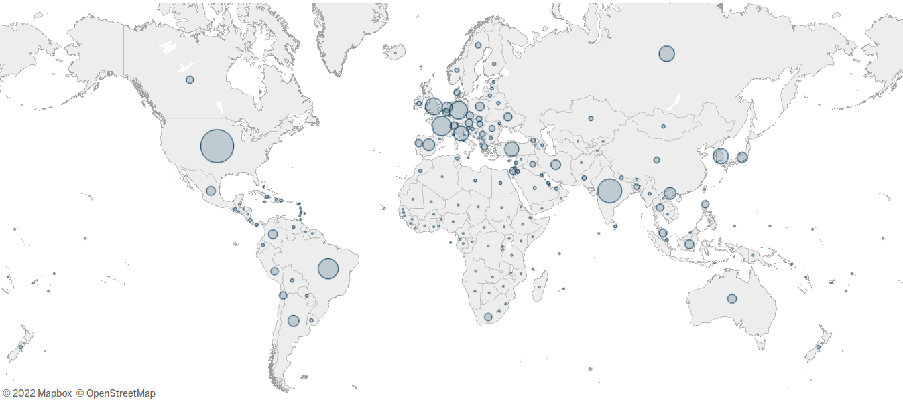
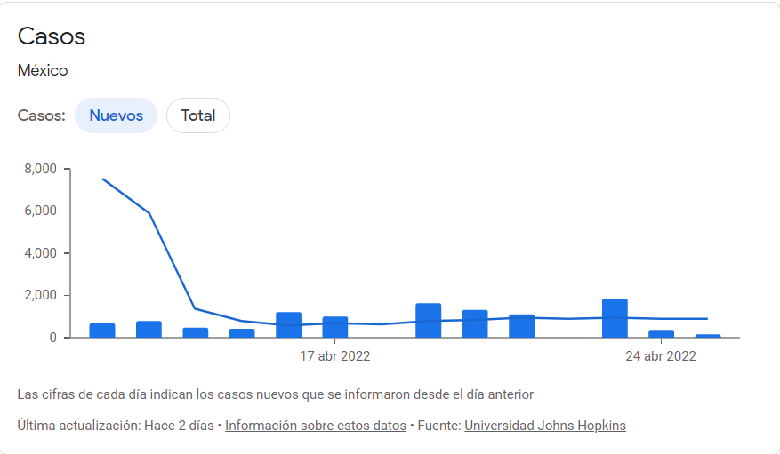
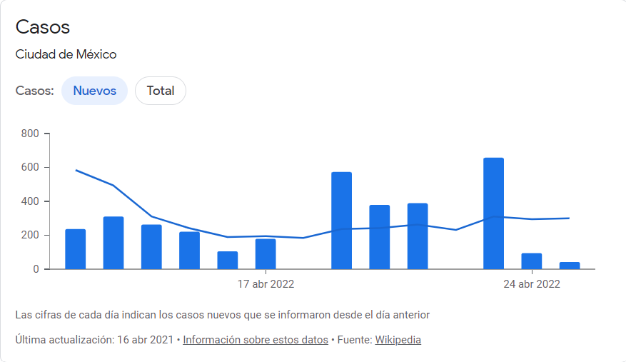
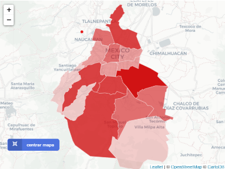

```{r setup, include=FALSE}
knitr::opts_chunk$set(echo = TRUE)
```

<center>


**Analisis de biologia computacional**


# BT1013.324


## Equipo 2


**Profesores: **  


Dra Laura Gómez  


Dr. Hugo Tovar  


Febrero – Junio  


Fecha de entrega: 26/04/2022  
</center>

**1. ¿Cuál es la situación actuals de COVID-19 a nivel mundial, en México, en tu estado de origen y en tu municipio, alcaldía o colonia? **
Gracias a la aplicación de las diferentes vacunas, el SARS COV 2 ha bajado su nivel de alarma en el mundo. A pesar de esta evidente mejora, los contagios siguen aún sin detenerse. Un claro ejemplo es el continente Europeo, el cual sigue manteniéndose como el continente con más casos reportados al día de hoy y de igual forma Estados Unidos como uno de los países con mayor número de contagios.  
  
En México, podemos observar la mejoría en la situación ante la pandemia por COVID-19, teniendo solamente 11,806 nuevos casos reportados en todo el país de acuerdo con los datos recopilados por el gobierno mexicano en dos semanas.  
- **Total de casos:** 10,711  
- **Muertes:** 407  
- **% de vacunación:** 63.2 %  
  
Por su parte la Ciudad de México es el estado de la república con el mayor número de contagios en los últimos 14 días, probablemente porque su gran cantidad de habitantes por kilometro cuadrado, manteniendo un margen de aproximadamente 200 casos por día.  
  
En el siguiente mapa se puede ver que tanto la alcaldía Iztapalapa y la alcaldía Tlalpan poseen el mayor número de casos reportados tanto de contagios como de muertes.  
  
Aun así, gracias a las medidas de sanidad y la vacunación, la situación general de la pandemia es favorable para México y el mundo.  

**2. ¿Cuál fue la primera variante del virus que se propagó a todo el mundo?**  
La variante alfa de SARS-CoV-2 con linage *B. 1.1.7*, fue identificada por primera vez en Reino Unido en septiembre del 2020. En diciembre aumentaron las infecciones por esta variante, poco después se vieron más casos alrededor del mundo. En enero de 2021, en Estados Unidos se estableció como la variante más predominante, lo que la convirtió en una variante de preocupación (VOC). La variante alfa porta una mutación en la proteína S que "afecta la conformación del dominio de unión al receptor", posee una mutación la cual es la eliminación en las posiciones 69 y 70, la cual le da la carácter de mayor transmisibilidad. Después de ésta vino la variante delta, que tenía síntomas más graves que la antes mencionada. (Galloway, 2021)  

**3. ¿Cuáles son las otras variantes del virus que existen en otras regiones del mundo?**  
Una variante es un genoma viral que puede tener una o más mutaciones. Para la organización mundial de la salud, las variantes se pueden clasificar también por su linaje. De acuerdo con el SARS-CoV-2 Interagency Group (SIG) de Estados Unidos y la Organización Mundial de la Salud (OMS), existen las siguientes variantes que están monitoreando (CDC, 2022) (OMS, 2022): 
- Alpha (B.1.1.7 y linajes Q)  
- Beta (B.1.351 y linajes descendientes)  
- Gamma (P.1 y linajes descendientes)  
- Epsilon (B.1.427 y B.1.429)  
- Eta (B.1.525)  
- Iota (B.1.526)  
- Kappa (B.1.617.1)  
- Mu (B.1.621, B.1.621.1)  
- Zeta (P.2)  
Y además las variantes preocupantes en circulación:  
- Delta (B.1.617.2)  
- Omicron (B.1.1.529)  

**4. ¿Cómo buscarías información de la variante del virus en tu país?**  
Iniciaría mi búsqueda con artículos de divulgación científica para tener una información general de la variante en cuestión. Debe de ser de sitios confiables de divulgación. Una vez teniendo un poco del ámbito general sería momento de pasar a la información técnica y especializada. Entonces tendría que empezar a buscar en fuentes primarias con base en la disponibilidad que brinda el gobierno mexicano, empezando por sus portales de dependencia gubernamental. Para el caso del Sars Cov 2, sería necesario investigar el “Reporte de vigilancia genómica del virus SARS-CoV-2 en México”, ya que es actualizado periódicamente. La información dentro del informe está respaldadada por la Dirección General de Epidemiología, el Instituto de Diagnóstico y Referencia Epidemiológicos, y de la Unidad de Desarrollo Tecnológico e Investigación Molecular. También se pueden consultar documentos de la OMS para el caso específico de México. Sin embargo, para obtener información más técnica de las cadenas analizadas en México podemos revisar bases de datos que están a la disposición por la DGE actualizadas con perioridad. El portal de datos abiertos puede proporcionar datos recopilados en todo México que pueden ser de utilidad. Bases de datos como GISAID también entran en esta categoría.  

**5. Imagina que te encuentras en una situación similar a la de Li Wenliang, médico chino que intentó alertar sobre el brote de coronavirus en su país, pero fue detenido por las autoridades y obligado a retractarse, ¿qué harías en su caso? Selecciona un inciso y justifica tu elección: a) Lo reportas al centro de investigación o la universidad. b) Lo reportas a la prensa. c) Guardas la información. Elige y justifica tu respuesta.**  
*a) Lo reportas al centro de investigación o la universidad.*  
En mi caso personal, considero que es mejor reportarlo al centro de invetigación local o una universidad. De este modo se puede tener un respaldo institucional de las observaciones y posteriormente poner la información al público. Esto porque no todas las enfermedades tienen el mismo nivel de contagio, gravedad o mortalidad. Entonces disruptir el orden público puede ser perjudicial en cualquier contexto. A pesar de que la forma más inmediata es reportarla a la prensa, una universidad y/o centro de investigación puede brindar seguridad y el respaldo necesario para llamar a la alerta local, regional o nacional según sea el caso.  

### PARTE 2  
**Realiza lo siguiente en un script de R y código:**
```{r, include = FALSE}
# Agrega el working directory
setwd("G:\\Mi unidad\\ESCUELA\\Profesional\\2 Semestre\\Biologia_Computacional\\SituacionProblema\\codigo")
```

**1. Obtén las secuencias de las variantes de SARS-CoV-2 desde el NCBI o el buscador de virus del NCBI.**
```{r}
# Utiliza el paquete seqinr
library(seqinr)
variants <- list(
  alpha = read.fasta("./fasta/alpha.fasta"),
  beta = read.fasta("./fasta/beta.fasta"),
  delta = read.fasta("./fasta/delta.fasta"),
  epsilon = read.fasta("./fasta/epsilon.fasta"),
  eta = read.fasta("./fasta/eta.fasta"),
  gamma = read.fasta("./fasta/gamma.fasta"),
  iota = read.fasta("./fasta/iota.fasta"),
  kappa = read.fasta("./fasta/kappa.fasta"),
  mu = read.fasta("./fasta/mu.fasta"),
  omicron = read.fasta("./fasta/omicron.fasta"),
  zeta = read.fasta("./fasta/zeta.fasta")
  )
names(variants) <- c("alpha", "beta", "delta", "epsilon", "eta", "gamma", "iota", "kappa", "mu", "omicron", "zeta")
# Imprime las primeras 200 bases y las últimas 200
i <- 1
for(el in variants){
  size <- length(el[[1]])
  print(names(variants)[i])
  print(el[[1]][1:200])
  print(el[[1]][(size - 199):size])
  i <- i + 1
}
rm(size, i)

```
**2. Calcula la longitud de las secuencias de cada variante.**
```{r}

lengthVars <- lapply(variants, function(chain) length(chain[[1]]))

names(lengthVars) <- names(variants)
print(lengthVars)
```
**3. Crea una gráfica donde compares las bases de ADN que componen a cada una de las variantes del virus.**
```{r}
bases <- function(chains){
  comps <- lapply(chains, table)
  b <- c()
  for(el in comps){
    b <- c(b,as.numeric(el))
  }
  return(list(
    a = b[seq(from = 1, to = length(b), by = 4)],
    c = b[seq(from = 2, to = length(b), by = 4)],
    g = b[seq(from = 3, to = length(b), by = 4)],
    t = b[seq(from = 4, to = length(b), by = 4)]
  ))
}

B <- bases(variants)

colors <- c("pink", "blue", "yellow","purple", "cyan", "magenta", "gray", "red", "black", "green", "orange")

par(mar = c(5,4,4,8), xpd = T)
barplot(matrix(c(B$a, B$c, B$g, B$t), nrow = 11), beside = TRUE, col = colors, las =2, names.arg = c("A", "C", "G", "T"), ylab = "Frecuencia", xlab = "Bases")
legend("topright",legend = names(variants) , col = colors,  pt.cex = 1, pch = 15 , cex = 1, inset = c(-0.2,0))
rm(colors)

```
**4. ¿Cuál es el %GC de cada variante?**
```{r}
GCperc <- c()
for(el in variants){
  GCperc <- c(GCperc, GC(el[[1]]))
}
rm(el)
names(GCperc) <- names(variants)
print(GCperc)
```

**5. Crea las secuencias contrasentido de cada variante.**
```{r}
inv <- function(chain){
  C <- as.character(chain[[1]])
  return(C[length(C): 1])
}

contra <- lapply(variants, inv)
names(contra) <- names(variants)

# Imprime las primeras 200 bases y las últimas 200
i <- 1
for(el in contra){
  size <- length(el)
  print(names(contra)[i])
  print(el[1:200])
  print(el[(size - 199):size])
  i <- i + 1
}
rm(size, i)
```

**6. Agrega una interpretación escrita de las gráficas que integras.**  

Viendo la gráfica podemos notar que no hay mucha diferencia entre las variantes de acuerdo con la escala del gráfico. Esto mismo también se puede comprobar con la composición de GC, dado que la mayoría se parece. Naturalmente, todas las variantes tienen un bajo contenido de guanina y citosina en comparación con la adenina y timina. Esto involucra que se forman menos puentes de hidrógeno y la temperatura necesaria para llevar a cabo la desnaturalización del ADN se vuelve menor. Por ende, baja también su temperatura de fusión de su ADN.  

El calcular esta temperatura es un proceso más difícil, pero se concluye que es baja por la composición de sus bases. Las dos variantes preocupantes (VOC) se parecen bastante en cuanto a su contenido de bases, esto hablando de la variante delta y omicron.   

Un estudio de árboles filogenéticos debería confirmar si la variante omicron es parecida a la variante delta o hay una variante intermediaria entre ambas. Sin embargo, con la gráfica no se puede rectificar porque la variante omicron resulta ser más contagiosa que la variante delta y la variante delta genera síntomas de mayor gravedad. Para estudiar esto se tienen que hacer estudios de los distintos genes de las variantes y sus mutaciones.  